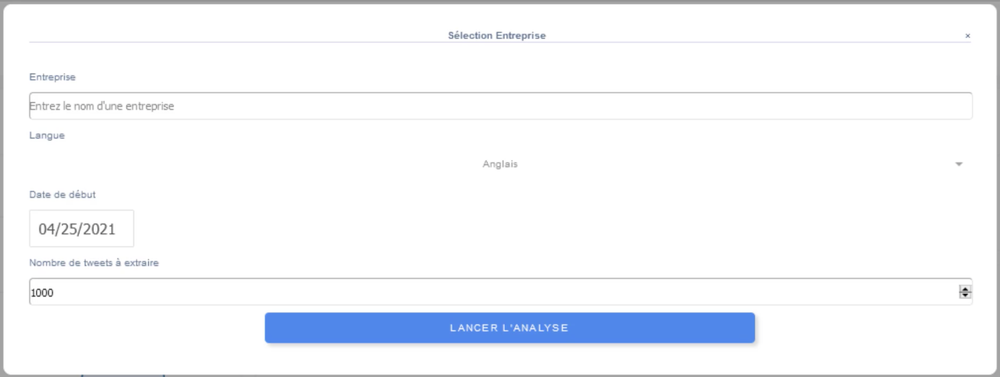
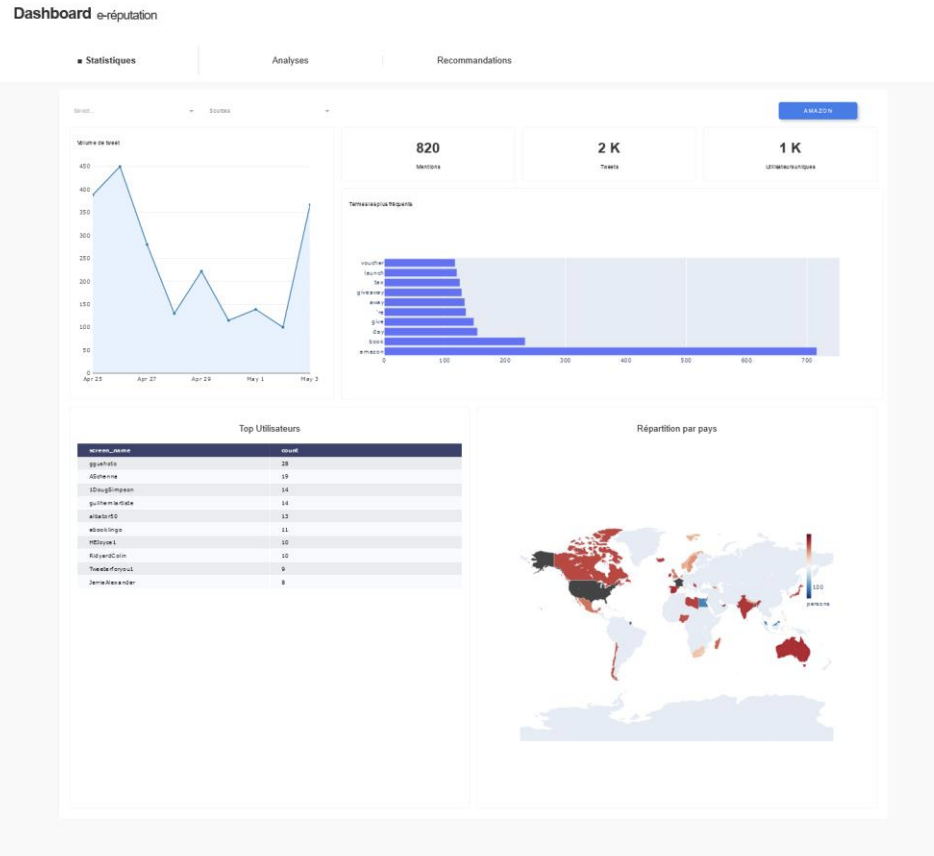
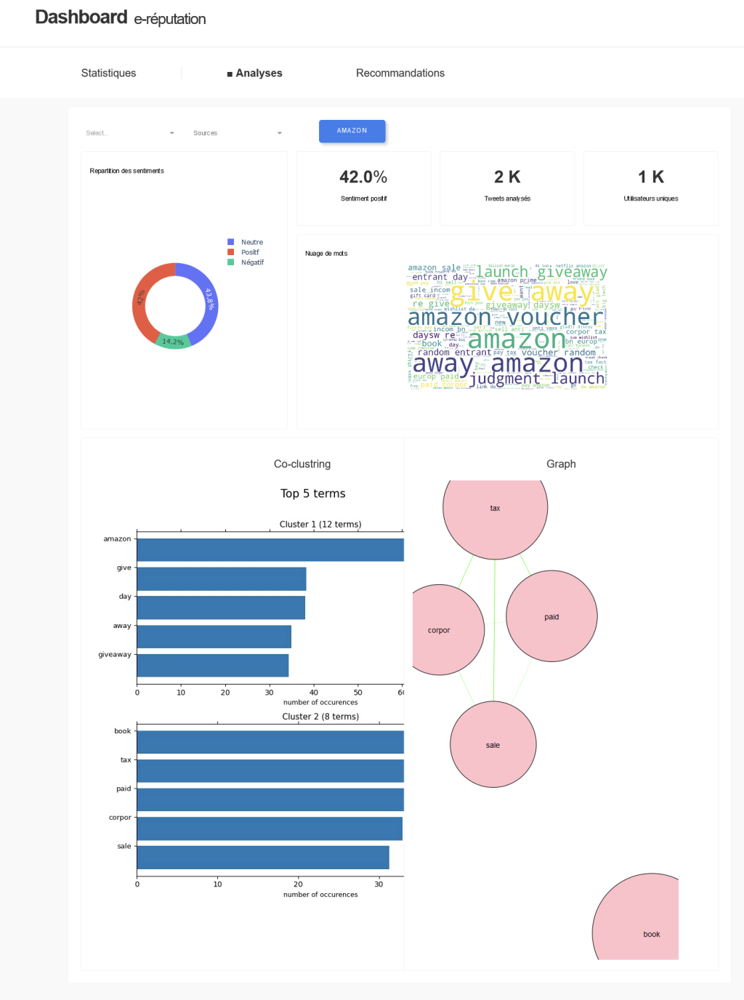

# Dashboard e-reputation

Le but de ce projet est d’élaborer une interface permettant la présentation des résultats d’analyse de e-réputation, à partir des tweets, pour les différents produits d’une même marque. Cette interface fournit également des recommandations pour l’entreprise afin que celle-ci mette sur le marché des produits vendeurs.

Voici les tâches effectuées pour créer l'interface:

- Analyse de texte

	- Extraction des tweets
	- Nettoyage et préparation des tweets
	- Exploration et analyse des tweets en utilisant des approches de visualisation, “Topics modeling” (LDA, NMF), et d’analyse de sentiment
	- Implémentation des méthodes de nettoyage et d’analyse des tweets et intégration à l’interface web

- Description des tâches techniques
	- Identification des indicateurs et des sources les plus importants
	- Identification des recommandations d’intérêt
	- Implémentation d’un outil d’analyse de textes
	- Design d’une interface de visualisation des résultats

